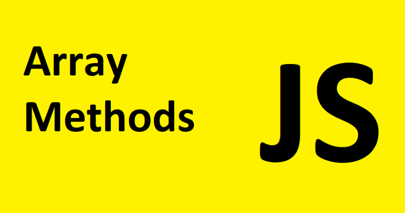
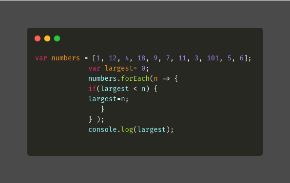
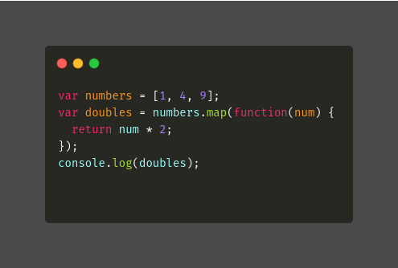
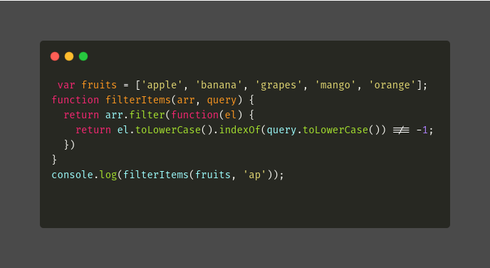
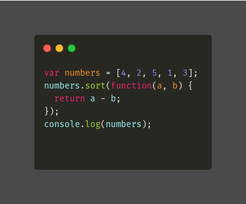
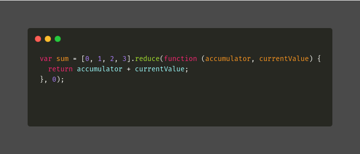

Arrays provide a lot of methods. To make things easier, let us see some of the methods in javascript.

1.  forEach

2.map

3.filter

4.sort

5.reduce

### 1\. forEach

The forEach() method executes a provided function once for each array element.

forEach doesn’t return anything ie. undefined.

**Syntax:** arr.forEach(callback(currentValue , index , array);

**Example:**

---

### 2\. map

map method creates a new array with the results of called function for every array element.

map returns the same sized new array.

**Syntax:** arr.forEach(callback(currentValue , index , array){};

**Example:**

---

### 3\. filter

filter method is used to create a new array from a given array, which satisfies a condition set by the argument function.

**Syntax:** var newArray = arr.filter(callback(element, index, array)

**Example:**

---

### 4\. sort

The sort() method sorts the elements of an array in place and returns the sorted array. The default sort order is ascending.

The array is sorted in place, and no copy is made.

**Syntax:** arr.sort(\[compareFunction\])

**Example:**

---

### 5\. reduce

The reduce() method executes a reducer function (that you provide) on each element of the array.

reduce returns any kind of datatypes ie. primitive and non-primitive

**Syntax:** arr.reduce(callback(accumulator, currentValue\[, index\[, array\]\])\[, initialValue\])

The reducer function takes four arguments:

Accumulator (acc)

Current Value (cur)

Current Index (idx)

Source Array (src)

**Example:**

---

### Conclusion

I have discussed some of the **array methods** with syntax and each example that can be used while writing functions.

### Reference

[**Array methods**  
_Arrays provide a lot of methods. To make things easier, in this chapter they are split into groups. We already know…_javascript.info](https://javascript.info/array-methods "https://javascript.info/array-methods")
