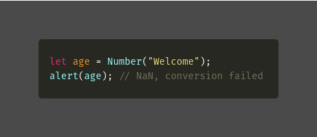

**Variable definition with (let, var, const).**

**Data Types**

**typeof**

**Type Conversions**

### 1\. Variable

Variable is named storage for data, we can use variables to store data in JavaScript, a variable can contain any data.

To create a variable in JavaScript, we use let, var and const keyword.

Declaring a variable using let, var and const keyword:

let message

var message;

const message;

So now, we can store some data in a variable, name called message by using the assignment operator =

let message;

message = “Welcome”;

**We can access it using the variable name:**

**Also, we can declare multiple variables in one line**

**We can also change the value of the variable:**

**We can declare two variables and copy data from one into the other.**

**Naming a variable:**

We can use camelCase for naming a variable, the name must contain only letters, digits, or the symbols $ and \_.

And the main thing is that the 1st character must not be a number.

let firstName;

let abc123;

Use camelCase when there are multiple words, JavaScript is a case sensitive language where let name; and let Name; are different variables.

**Some of the Reserved names in JavaScript:**

let, var, const, class, function, and return, etc.

**let **— it is a modern type of variable declaration.

**var **— it is an old school type of variable declaration.

**const **— it is similar to let keyword, but the declared value can’t be changed.

---

### 2\. Data types

Numbers, Strings, Boolean, Null, Undefined, Symbols and Objects

#### **Primitive Datatypes**

**a. Numbers:**

The number type represents both integer and floating-point numbers.

Example:

Many operations can be done using numbers i.e addition, subtraction, multiplication, division and so on.

Example:

**b. Strings:**

A string is one of JavaScript datatype which is enclosed by quotes.

Example:

let str = “hai”;

In JavaScript, there are three types of quotes.

**Single quotes:** let str1 = ‘hey’;

**Double quotes:** let str = “welcome”;

Note: Double quotes and Single quotes don't have any difference in JavaScript.

**Backticks:** let str2 = \`hello\`;

Backticks are like extended functionality quotes, we can embed variables and expression into a string by wrapping them in ${…}

Ex: embedded variable

let name = ‘Ashwin’;

alert(\`Hai, ${name}\`); // Hai, Ashwin

Ex2: embedded an expression

alert(\`the result is, ${15+10}\`); // the result is, 25

**c. Boolean:**

Boolean is a logical type, it has only two values true and false.

Example:

**d. null:**

It is a special kind of data type, which contains the null value.

Example:

let student = null;

The above code states that the value of “student” is empty.

**e. undefined:**

It is also a special data type, undefined means value is not assigned.

If a variable is declared, but not assigned, then its value is undefined

Example:

We can assign undefined to any variable

**f. Symbols:**

We never use symbols much in Java Script, symbols are a unique identifier.

Value can be created using Symbol()

Example:

let name = Symbol(); // name is a new symbol

#### **Non — Primitive Datatypes**

**g. Objects:**

An object is a collection of “key and values”, they are written within curly braces {}

Object properties are written as key: value, separated by commas.

Example:

---

### **3\. typeof**

typeof is an operator that can help to find the type of variable, It’s useful for a quick check.

Syntax:

typeof x // operator

typeof (x) // function

Example:

---

### **4\. Type Conversions**

Operators and functions automatically convert the values given to them called an implicit conversion.

Using alert() it automatically converts any value to a string and mathematical operations convert values to numbers.

Sometimes we need to explicitly convert a value to the expected type.

**a. String Conversion:**

When we need string from the value we can convert it explicitly to get the expected type i.e string.

Example:

To convert any value to String use keyword String()

String(7 + 10); // “17” which gives u string (converting number into string)

**b. Numeric Conversion:**

To convert for numeric we use Number() keyword, it is also an explicit conversion.

Example:

If the string is not a valid number, the result of such a conversion is NaN.

Example:

**c. Boolean Conversion:**

It is the simple conversion, using the Boolean() keyword we can explicitly convert.

The values that are 0, empty string, null undefined and NaN become false other values become true.

Example:

Note:

alert( Boolean(“0”) ) // true;

The string with zero “0” is true because a non-empty string is always true.

alert( Boolean(“ “) ); // true

Spaces, also true because it's not an empty string.

---

### Conclusion

Here I have described about the Variable definition with (let, var, const), Data Types, typeof, and Type Conversions which helps to understand the javascript.

### Reference

[**The Modern JavaScript Tutorial**  
_Modern JavaScript Tutorial: simple, but detailed explanations with examples and tasks, including: closures, document…_javascript.info](https://javascript.info/ "https://javascript.info/")
