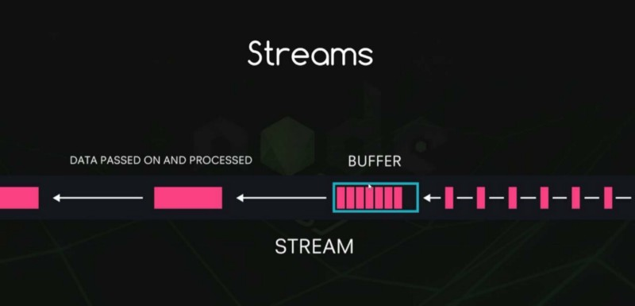
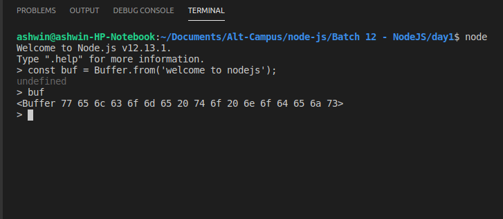

### Introduction

Buffer is an object property on Node js global object, which is heavily used in Node to deal with streams of binary data. As it is globally available, there is no need to require it in our code.

Buffer is a chunk of memory allocated outside of the V8 heap.  V8 is the default JavaScript engine which powers Node and Google Chrome. In Node, buffers are implemented using a JavaScript typed array (`[Uint8Array](https://developer.mozilla.org/en-US/docs/Web/JavaScript/Reference/Global_Objects/Uint8Array)`), but that does not mean the memory allocated to the buffer is inside of the V8 heap. It is still explicitly allocated outside the V8 heap.

So we can think of a buffer as some kind of array which is a lower-level data structure to represent a sequence of binary data, but there is one major difference: Unlike arrays, once a buffer is allocated, it cannot be resized.

### Buffer and Character Encoding

Whenever the data is stored in or extracted out of a buffer instance, it is simply the binary data.

As we are creating a buffer _‘welcome to nodejs_’ string (we will discuss creating buffers in a second), you can see we are getting some hexadecimal-sequence preview. It is because we have not specified any character encoding.

So whenever there is a buffer, there must be some character encoding to read back the data properly (i.e., whenever we read some content from a file we read it as a buffer, so if we do not specify a character encoding, we will get back a buffer object).

You can see that when the different character encodings are applied to the buffer, we get different results. So this is how the character encoding can change our data as. If no argument is given to the method, it takes ‘utf8’ encoding by default.

Different types of supported character encodings in Node js are:

-   ‘ASCII’: For 7-bit ASCII data only.
-   ‘utf8’: Multibyte encoded Unicode characters.
-   ‘utf16le’: 2 or 4 bytes, little-endian encoded Unicode characters.
-   ‘ucs2’: Alias of ‘utf16le’.
-   ‘base64’: Base 64 encoding.
-   ‘latin1’: A way of encoding the Buffer into a one-byte encoded string.
-   ‘binary’: Alias for ‘latin1’.
-   ‘hex’: Encode each byte as two hexadecimal characters.

### Creating Buffer

There are three ways to create buffers:

1.  Buffer.from()
2.  Buffer.alloc()
3.  Buffer.allocUnsafe()

### Buffer.from()

Buffer.from is used to create a buffer from either an array, a string, or from a buffer itself.

Buffer.from(‘welcome to nodejs’)

Prints: <Buffer 77 65 6c 63 6f 6d 65 20 74 6f 20 6e 6f 64 65 6a 73>

### Buffer.alloc()

Buffer.alloc takes a size (integer) as an argument and returns a new initialized buffer of the specified size (i.e., it creates a filled buffer of a certain size).

Buffer.alloc(7)

Prints: <Buffer 00 00 00 00 00 00 00>

### Buffer.allocUnsafe()

Buffer.allocUnsafe takes in size as an argument and returns a new buffer that is non-initialized. That means it can contain some old or sensitive data out of your memory. So it must be used with care. As there is no initialization involved while creating the buffer, this method is faster than the Buffer.alloc().

Buffer.allocUnsafe(7) might Prints:<Buffer d0 ed 02 00 00 00 00>

We can see that there is some information left in our buffer which comes directly from our memory. In order to protect our sensitive information we need to prefill this buffer and we do that by using the fill() method.

Buffer.allocUnsafe(7).fill() Prints: <Buffer 00 00 00 00 00 00 00>

### Conclusion

Buffers are very useful when we need to read things like an image from a TCP stream, a compressed file, or any other form of binary data. Buffers are heavily used in streams in Node, so it is good to have a basic understanding of them.

### References

[**Node.js v13.6.0 Documentation**  
_Prior to the introduction of TypedArray , the JavaScript language had no mechanism for reading or manipulating streams…_nodejs.org](https://nodejs.org/dist/latest-v12.x/docs/api/buffer.html "https://nodejs.org/dist/latest-v12.x/docs/api/buffer.html")
