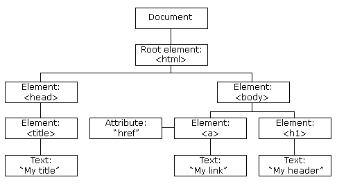
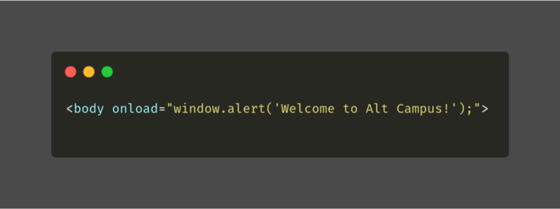
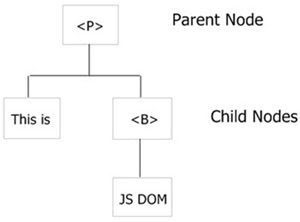
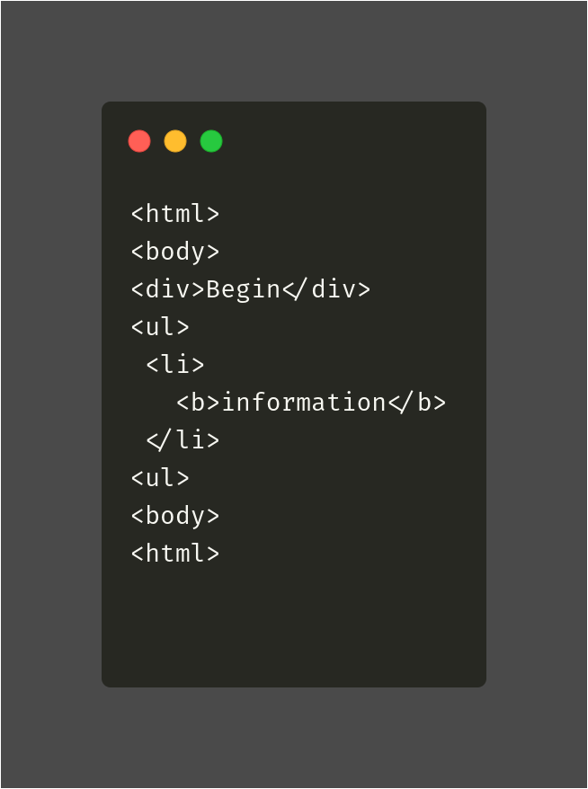

The Document Object Model (DOM) is a programming interface for HTML documents.

In other words, DOM is an object-oriented representation of the web page, which can be modified with a scripting language such as JavaScript.

**Example:**

### **Methods of Document Object**:

-   **getElementById():** returns the element having the given id value.
-   **getElementsByName():** returns all the elements having the given name value.
-   **getElementsByTagName():** returns all the elements having the given tag name.
-   **getElementsByClassName():** returns all the elements having the given class name.

### **documentElement and body**

The topmost tree nodes are available directly as document properties:

-   **<html> = document.documentElement :** The topmost document node is document.documentElement. That’s the DOM node of the <html> tag.
-   **<body> = document.body:** Another widely used DOM node is the <body> element document.body.
-   **<head> = document.head:** The <head> tag is available as document.head.

### DOM Nodes

Every element in an HTML page represents a DOM node. These elements are related to each other through the parent-child relationship.

All the nodes in a document make a DOM tree, which describes the relationship.

An element inside another element is known as the child element or child node and the element that contains the element within it is known as the parent element or parent node.

Let’s take an example to understand nodes in JavaScript.

This is JS DOM

In the above code, there are two nodes, P and a text node. The combination of both the nodes represents a paragraph. Let’s take another code fragment to understand it better.

This is <B>JS DOM</B>

The above code created one parent node (P) and two child nodes (text and B node). Further, the B node also contains a child node (text).

### childNodes, firstChild, lastChild

**Child nodes:** ELements that are direct children. In other words, they are nested exactly in the given one. For instance, <head> and <body> are children of <html> element.

**Descendants:** All elements that are nested in the given one, including children, their children and so on.

For instance, here <body> has children 
 and <ul> and descendants of <body> are not only direct children 
, <ul> but also more deeply nested elements, such as <li> (a child of <ul>) and <b> (a child of <li>) the entire subtree.

### Conclusion

Here I tried to tell about the basics of DOM, Methods of document object, documentElement and body, DOM Nodes and childNodes, firstChild, lastChild.

### References

[**Document**  
_We want to make this open-source project available for people all around the world._javascript.info](https://javascript.info/document "https://javascript.info/document")
