In this article, we gonna talk about Comparisons, Interaction and Conditional operators: if, ‘?’

### Comparisons

We all know many comparison operators from maths such as

Greater than: a > b

Lesser than: a < b

Greater than or equals: a >= b

Lesser than or equals: a <= b

Equals: a == b (this is the equal symbol, where single = is for assignment)

Not equals: a != b

**Comparison of different types**

When we compare values of different types, Java Script converts the values to numbers.

Example:

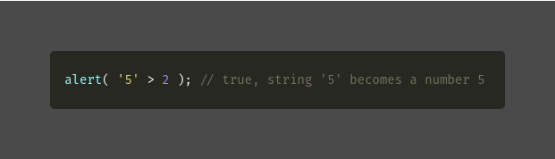

**Strict equality**

Equality check == has a problem, that it cannot differentiate 0 and empty string from false

alert( 0 == false ); // true

Because operands of different types are converted to numbers by the equality operator ==, to overcome this problem we have strict equality i.e === where it checks the equality without any type conversion

Example:

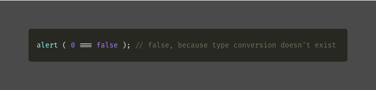

**Comparing with null and undefined**

Using non-strict equality ==

alert ( null == undefined ); // true because of type conversion.

Using strict equality ===

In these, the values are different and type conversion doesn’t exist

alert ( null === undefined ); // false

---

### **Interaction**

In these, we will talk about the browser functions i.e alert, prompt and confirm

**alert:**

Shows a message.

Syntax: alert(message);

This shows a message and pauses the script execution until the user presses ok

Example: alert(“hello”);

When you run this code a pop-up will be shown from browser window displaying hello.

**prompt:**

Shows a message asking the user to input text.

Which accepts two arguments i.e

result = prompt(title, \[default\]);

title: the text to show the visitor.

default: it is an optional second parameter, the initial value for the input field.

Example:

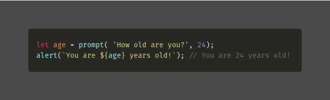

**confirm:**

Shows a message and waits for the user to press ok or cancel, it returns true for ok and false for cancel

Syntax: Result = confirm(question);

Example:

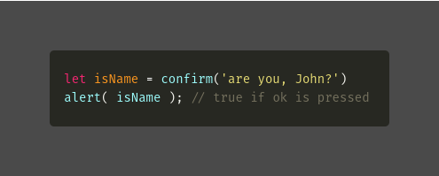

---

### **Conditional operators: if, ‘?’**

To perform different actions based on different conditions, we can use if statement and the conditional operator-?

**a. if statement:**

It evaluates the content only if the expression is true.

Syntax:

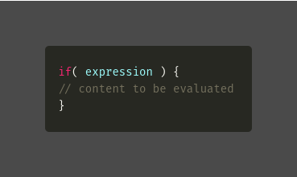

Example:

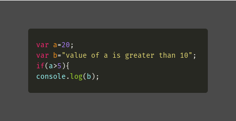

**b. “else” clause:**

The if statement may contain an optional “else” block. It executes when the condition is false.

Syntax:

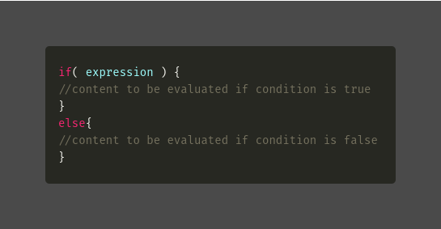

Example:

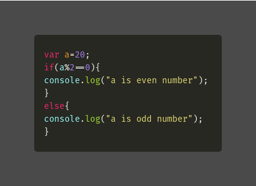

**c. else if:**

It helps to test several variants of a condition.

Syntax:

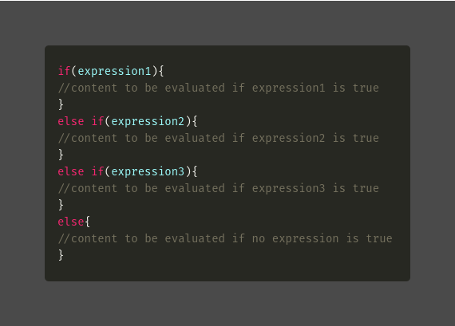

Example:

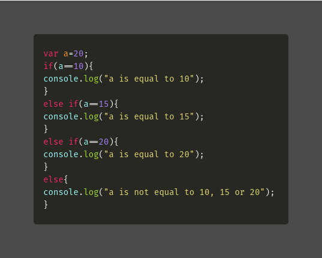

**d. Conditional operator ‘?’**

Using this operator we can make a condition in a shorter and simpler way.

Sometimes it’s called “ternary” because the operator has three operands. It is actually the one and only operator in JavaScript which has that many.

Syntax: let result = condition ? value1 : value2;

The condition is evaluated if it’s true value1 is returned, else value2.

Example:

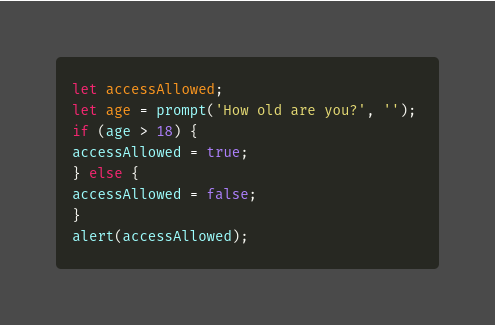

So the above condition can be redefined or written using condition operator ‘?’

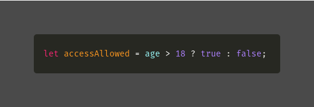

---

### Conclusion

In this article, I have explained the Comparisons, Interaction, and Conditional operators: if, ‘?’ from this, we could understand and learned how to use this in programs.

### Reference

[**The Modern JavaScript Tutorial**  
_Modern JavaScript Tutorial: simple, but detailed explanations with examples and tasks, including: closures, document…_javascript.info](https://javascript.info/ "https://javascript.info/")
