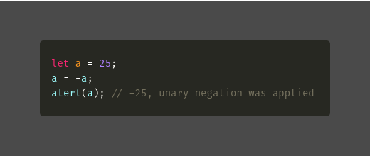
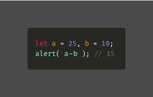
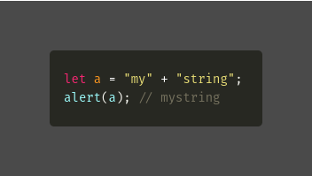
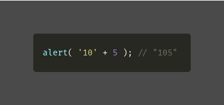
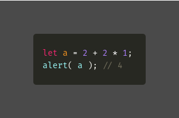
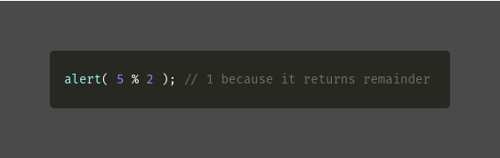
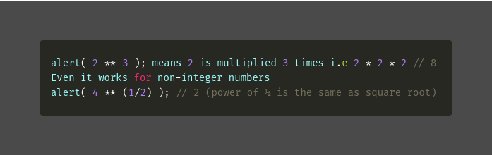
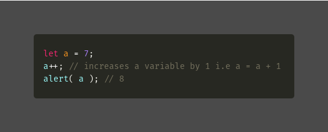
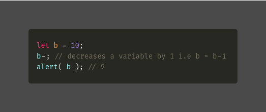
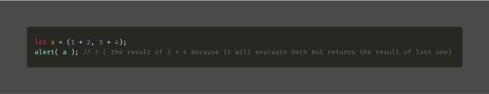

We all know a few operators from school i.e addition +, division /, subtraction -, multiplication \* and so on, operators always return a value.

An argument is what operators are applied to. For example addition of 5 + 2 here we have two arguments i.e left argument 5 and right argument 2

**a. Unary Operator:**

An operator is unary if it has a single argument in it.

Example:

---

**b. Binary Operator:**

An operator is binary if it has two arguments.

---

**c. String Concatenation:**

Usually, we know that the plus operator + sums numbers, but if the plus operator is applied to strings, it merges (concatenates) them.

Example:

Note:

If one argument is a string, the other argument is also converted to a string.

Example:

---

**d. Assignment:**

Assignment = is also an operator, when we assign a variable like a = 2 + 2 \* 1, the calculations are done first and then the = is evaluated, storing the result in a. Even the assignment operator returns a value

Example:

---

**e. Remainder:**

The Remainder % is an operator, not a percentage symbol, it returns the remainder.

Example:

---

**f. Exponentiation:**

Exponentiation operator \*\* is a recent addition to the language.

a \*\* b where b is a natural number and a is multiplied by itself b times.

Example:

---

**g. Increment/decrement:**

We can increase or decrease a number by 1 and it is the most common operation around all programming language

Increment/decrement can only be applied on variables not on values, it gives an error

The operators ++ and -- can be placed either before or after a variable.

postfix = a++ i.e using after the variable

prefix = ++a i.e using before the variable

Both of these statements do the same thing increases a by 1, but there is small difference prefix returns the new value while the postfix returns the old value

**Increment ++** ( increases a variable by 1 )

Example:

**Decrement — **(decreases a variable by 1)

Example:

---

**h. Bitwise operators:**

These operators can be seen in almost all programming languages.

AND ( & )

OR ( | )

NOT ( ~ )

These operators are used very rarely.

---

**i. Comma:**

The comma operator is one of the rarest operators, it’s used to write shorter code.

Example:

---

### Conclusion

I have been discussed about the javascript operators, using this we can know how to use the operators in javascript programming.

### Reference

[**The Modern JavaScript Tutorial**  
_Modern JavaScript Tutorial: simple, but detailed explanations with examples and tasks, including: closures, document…_javascript.info](https://javascript.info/ "https://javascript.info/")
